## Repository Block Diagram

```mermaid
---
config:
  layout: elk
---
flowchart TD
  subgraph User[CLI]
    A[seizure-pred]
    A1[preprocess-chbmit]
    A2[train]
    A3[predict]
    A4[analyze]
    A --> A1
    A --> A2
    A --> A3
    A --> A4
  end

  subgraph Config[Configuration and registries]
    B1[YAML experiment config]
    B2[Config validation<br/>TrainConfig and CvConfig]
    B3[Registries<br/>dataset, dataloader, model,<br/>loss, optimizer, scheduler, callbacks]
    B1 --> B2 --> B3
  end

  subgraph Data[Preprocessing and data]
    C1[Raw CHB-MIT EDF / BIDS]
    C2[Filter, ICA, downsample,<br/>normalize and segment]
    C3[NPZ windows<br/>signal, label and metadata]
    C4[CHBMITDataset]
    C5[Outer CV split<br/>train-validation + held-out test]
    C6[Inner CV split<br/>train + validation]
    C7[DataLoaders<br/>undersampled train + standard val/test]
    C2 --> C3 --> C4 --> C5 --> C6 --> C7
  end

  subgraph Model[Selected model from the model registry]
    D1[Model factory]
    D2[One configured architecture<br/>for example EEGWaveNet, CNN,<br/>GNN, Transformer or MIL model]
    D3[Binary logit / prediction head]
    D1 --> D2 --> D3
  end

  subgraph Training[Nested-CV training per inner fold]
    E1[Build loss, optimizer,<br/>optional scheduler and callbacks]
    E2[Trainer or TrainerMIL]
    E3[Fit on train loader]
    E4[Validate and select best checkpoint<br/>using configured monitor]
    E5[Restore best checkpoint]
    E6[Evaluate validation and held-out test]
    E7[Inner-fold artifacts<br/>checkpoint, history, metrics, predictions]
    E1 --> E2 --> E3 --> E4 --> E5 --> E6 --> E7
  end

  subgraph Evaluation[Outer-fold inference and analysis]
    F1[Ensemble inner-fold<br/>test probabilities]
    F2[Outer-fold predictions.jsonl<br/>and metrics.json]
    F3[Complete nested-CV result<br/>raw_predictions.pkl]
    F4[Standalone prediction<br/>restore one or many checkpoints]
    F5[predict / predict_ensemble]
    F6[Analysis runner]
    F7[Per-split classification analysis]
    F8[Binary report, confusion matrix,<br/>ROC and PR curves]
    F9[Nested preictal probability analysis]
    F10[Per-event probability comparison<br/>inner folds + outer ensemble]
    F11[Preictal/interictal aggregate analysis<br/>moving average, threshold and calibration sweeps]
    F12[Sensitivity and interictal FPR/hour<br/>Pareto and parameter-sweep plots]
    F1 --> F2 --> F3
    F4 --> F5
    F2 --> F6
    F5 --> F6
    F6 --> F7 --> F8
    F6 --> F9 --> F10
    F6 --> F11 --> F12
  end

  C1 --> A1 --> C2
  A2 --> B1
  B3 --> C4
  C7 --> D1
  B3 --> D1
  B3 --> E1
  D3 --> E2
  C7 --> E2
  E7 --> F1
  A3 --> B1
  B3 --> F4
  C4 --> F4
  A4 --> F6
```

The model box represents one architecture selected by `cfg.model.name`. CNN,
graph, transformer, and MIL models are alternatives in the model registry; they
are not a fixed sequence through which every input passes.
  FPR/hour.
